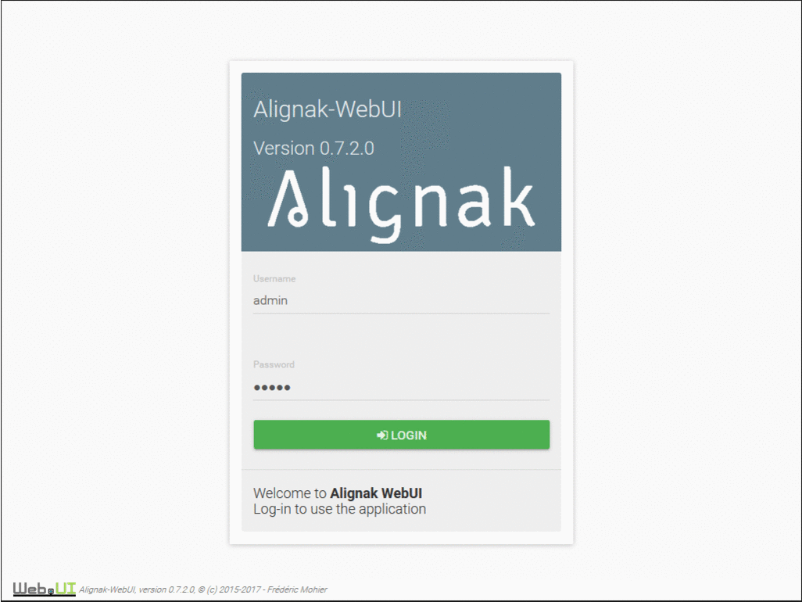

Alignak Web UI
##############

*Web User Interface for Alignak monitoring framework ...*

.. image:: https://api.travis-ci.org/Alignak-monitoring-contrib/alignak-webui.svg?branch=develop
    :target: https://travis-ci.org/Alignak-monitoring-contrib/alignak-webui
    :alt: Develop branch build status

.. image:: https://landscape.io/github/Alignak-monitoring-contrib/alignak-webui/develop/landscape.svg?style=flat
    :target: https://landscape.io/github/Alignak-monitoring-contrib/alignak-webui/develop
    :alt: Development code static analysis

.. image:: https://coveralls.io/repos/Alignak-monitoring-contrib/alignak-webui/badge.svg?branch=develop
    :target: https://coveralls.io/r/Alignak-monitoring-contrib/alignak-webui
    :alt: Development code tests coverage

.. image:: https://readthedocs.org/projects/alignak-web-ui/badge/?version=develop
    :target: http://alignak-web-ui.readthedocs.io/?badge=develop
    :alt: Documentation Status

.. image:: https://img.shields.io/badge/IRC-%23alignak-1e72ff.svg?style=flat
    :target: http://webchat.freenode.net/?channels=%23alignak
    :alt: Join the chat #alignak on freenode.net

.. image:: https://img.shields.io/badge/License-AGPL%20v3-blue.svg
    :target: http://www.gnu.org/licenses/agpl-3.0
    :alt: License AGPL v3

.. image:: https://badge.fury.io/py/alignak_webui.svg
    :target: https://badge.fury.io/py/alignak_webui

Screenshots
===========

Documentation
=============

You can find online documentation on `Read The Docs <http://alignak-web-ui.readthedocs.io/?badge=latest>`_ and in the */docs* directory.

Installation
============

The Alignak WebUI is easily installed and started thanks to the Python Package:
::

    # Installing...
    pip install alignak-webui
    # Running...
    alignak-webui-uwsgi
    # Using!
    http://127.0.0.1:5001

**Note**: *Please note that you need to have a running Alignak framework reporting the live state to the Alignak backend.*

Bugs, issues and contributing
=============================

Contributions to this project are welcome and encouraged, but please have a look to the `contributing guidelines <./CONTRIBUTING.md/>`_  before raising an issue, or writing code for the project.

License
=======

Alignak WebUI is available under the `GPL version 3 <http://opensource.org/licenses/GPL-3.0>`_.
