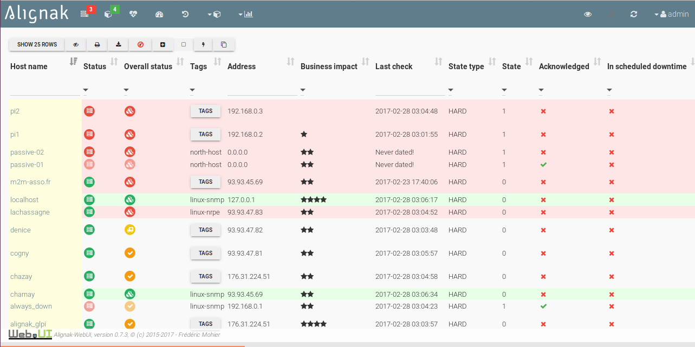

.. raw:: LaTeX

    \newpage

.. _configuration_ui_rendering:

UI rendering
============

Alignak WebUI is highly configurable and even some UI rendering can be configured to best suit the user's needs. This is what is introduced in the next chapters; each one made for a specific section of the Alignak WebUI configuration file.

[Alignak-WebUI] section
-----------------------

    * **livestate_layout**, configure the layout to be used in the livestate view: single table, multiple panels or tabbed view, for each business impact level

Some examples:

   Default configuration

   Panels layout

.. figure:: ../images/livestate-3.png
   :scale: 50 %
   :alt: Livestate rendering example - tabs

   Tabs

[on_off]
--------
This section allows to configure how the on/off (eg. enabled/disabled) is represented in the Web UI.
::

    [on_off]
    ; Global element to be included in the HTML and including the items and the text
    on=##message##

    ; Element to be included for each BI count
    off=##message##

[business_impact]
-----------------
This section allows to configure how the business impact of an element is represented in the Web UI.
::

    [business_impact]
    ; Global element to be included in the HTML and including the items and the text
    ;global=##items##&nbsp;##text##

    ; Element to be included for each BI count
    ;item=
    ; If item is empty, then the following unique is used in place
    ;item=

    ; Unique element
    ; ##bi## will be replaced with the business impact level value
    ;unique=
##bi##

    ; Number of elements to remove from the real business impact
    ; 0 is meaning that the defined item will be repeated twice for BI=2, third for BI=3
    ; 2 is meaning that the defined item will not be repeated for BI=2, and once for BI=3
    ;less=0

Some examples:

   Default configuration

.. figure:: ../images/bi-1.png
   :scale: 50 %
   :alt: BI rendering example

   Changed color

.. figure:: ../images/bi-2.png
   :scale: 50 %
   :alt: BI rendering example

   Icon and text

   Text only

[buttons]
---------

This section defines patterns used by the application to build the buttons commands toolbar.
::

    [buttons]
    ; First solution: a buttons group
    ; Global element to be included in the HTML
    ;livestate_commands=
##commands##

    ; Each command element to be included in the HTML
    ;livestate_command=<button class="btn btn-default" data-type="action" data-action="##action##" data-toggle="tooltip" data-placement="top" title="##title##" data-element_type="##type##" data-name="##name##" data-element="##id##" ##disabled##><i class="fa fa-##icon##"></i></button>

    ; Second solution (preferred one): a buttons dropdown list
    ; Global element to be included in the HTML
    livestate_commands=
<button type="button" class="btn btn-default dropdown-toggle" data-toggle="dropdown" aria-haspopup="true" aria-expanded="false">##title## </button><ul class="dropdown-menu">##commands##</ul>

    ; Each command element to be included in the HTML
    livestate_command=<li><button class="btn btn-default" data-type="action" data-action="##action##" data-toggle="tooltip" data-placement="top" title="##title##" data-element_type="##type##" data-name="##name##" data-element="##id##" ##disabled##><i class="fa fa-##icon##"></i>&nbsp;&nbsp;##title##</button></li>

[tables.lists]
--------------

This section defines patterns used by the application to build the elemnts lists in the tables.
::

    [tables.lists]
    ; Button to display the list
    button=<button class="btn btn-xs btn-raised" data-toggle="collapse" data-target="#list_##type##_##id##" aria-expanded="false">##title##</button>
##content##

    ; Global element to be included in the HTML for the list
    list=<ul class="list-group">##content##</ul>

    ; Each command element to be included in the HTML list
    item=<li class="list-group-item">&nbsp;##content##</li>

    ; Unique element to be included in the HTML list if the list contains only one element
    unique=##content##

[items] section
---------------

This section defines patterns used by the application to build the elements icons.
**TO BE COMPLETED**
