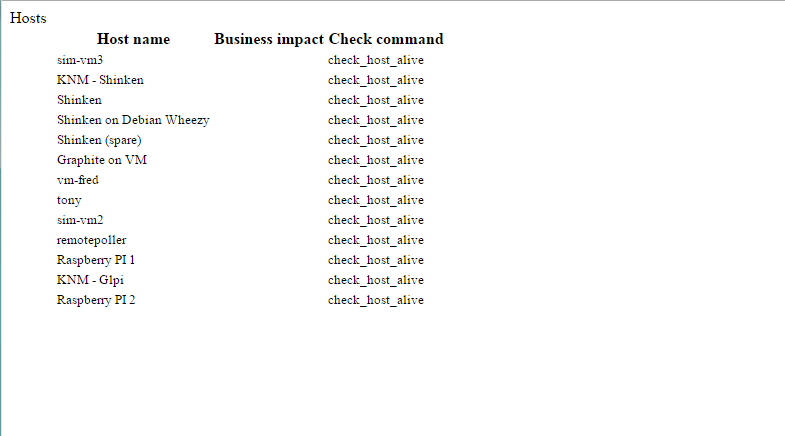
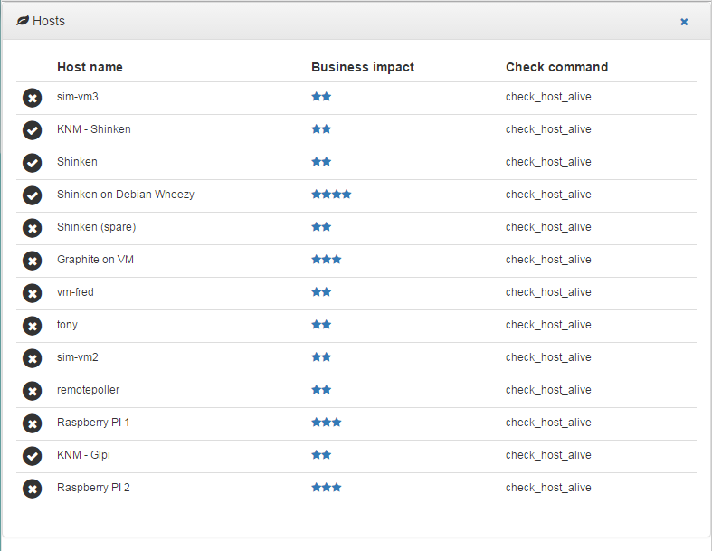
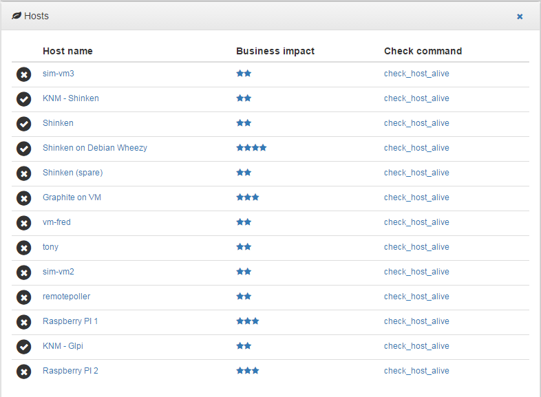

.. raw:: LaTeX

    \newpage

.. _api:

API
===

Internal routes
---------------
The application, as a Web application, manages routes. Some of them are application internal routes and most of them are provided by the application plugins.

The application provided routes:

    - /, to get the home page
    - /ping, used by the page refresh process
    - /login (GET), for the login form
    - /login (POST), for the login form
    - /logout, to log out the current user
    - /static/, to get the static pages (eg. js, css, ...)
    - /modal/, to display the modal dialog box with a specific content

Plugins routes
--------------

Each plugin defines routes that are added to the application routes when the plugin is loaded.

Most plugins are dedicated to a specific backend element (eg. host, service, ...). For those plugins, some rules, implemented in the Plugin class, are commonly used for the routes:

    - */elements*, get the paginated elements list
    - */elements/tree*, get the element tree view (for some elements)
    - */elements/table*, get the element table view
    - */elements/table_data*, get the element table data (called by the datatable)
    - */elements/templates/table*, get the element templates table view
    - */elements/templates/table_data*, get the element templates table data (called by the datatable)
    - */elements/list*, get all the elements list as a json list of objects containing `id`, `name` and `alias`
    - */elements/templates/list*, get all the elements templates as a json list of objects containing `id`, `name` and `alias`
    - */element/id*, get the view of a specific element. *id* may be the element `id` or `name`

Where `element` stands for the specific element name: host, service, user, ...

Get elements page
~~~~~~~~~~~~~~~~~

Most of the elements plugins provide a paginated view of the elements. Those views are not often used in the Web UI ... except when they are included in some mode complex views (eg. host view for the services)

Reload element configuration
~~~~~~~~~~~~~~~~~~~~~~~~~~~~

Most of the plugins have a configuration file used to define their table structure. Reloading the configuration file dedicated to an element is as easy as::

    /element/config

Get element page
~~~~~~~~~~~~~~~~

Some plugin provide a view for an element. This view / page is available on this endpoint::

    /host/_id

    /host/name

Get elements table
~~~~~~~~~~~~~~~~~~

This is the most common route provided by each plugin. It allows to display a table view for some elements.

Table view::

    /hosts/table

    /hosts/table?search=

    - `?search=` to clear all the table filters
    - `?search=name:value` to search for `value` in the column `name`
    - `?search=name:value name2:value2` to search for `value` in the column `name` and `value2` in `name2`

Get elements templates table
~~~~~~~~~~~~~~~~~~~~~~~~~~~~

This route is provided by plugins associated to templated elements (eg. host, service or user). It allows to display a table view for the element templates.

Templates table view::

    /hosts/templates/table

    /hosts/templates/table?search=

    - `?search=` to clear all the table filters
    - `?search=name:value` to search for `value` in the column `name`
    - `?search=name:value name2:value2` to search for `value` in the column `name` and `value2` in `name2`

Get elements tree
~~~~~~~~~~~~~~~~~

If the elements are linked together (eg. groups) a tree route will display a tree view of the elements.

Tree view::

    /hostgroups/tree

Get elements list
~~~~~~~~~~~~~~~~~

A JSON list of the elements and elements templates is available on the endpoint `/elements/list` and  `/elements/templates`.
If a templates URL parameter (GET or POST) exists, the elements list is completed with the templates list to get all the elements and templates.

List view::

    /hostgroups/list

    /hostgroups/templates/list

    /hostgroups/list?templates=1

External access
---------------
An external application can embed some Alignak WebUI widgets and pages.

Authentication
~~~~~~~~~~~~~~

Embedding a part of Alignak WebUI requires an authentication. Provide credentials as a Basic HTTP authentication in the page request. The HTTP request must have an 'Authorization' header  containing the authentication. The Alignak WebUI will use this authentication parameters to check authentication on its Alignak backend.

API
~~~

URL syntax::

    GET <alignak_webui>/external/<type>/<identifier>/<action>

    where:
        <alignak_webui> is the base url of your Alignak WebUI (eg. http://127.0.0.1:8868)
        <type> = `widget` for a widget, <identifier> is the identifier of the widget
        <type> = `table` for a table, <identifier> is the identifier of the table
        <type> = `list` for a list, <identifier> is optional
        <type> = `host` for an host widget, <identifier> is the identifier of the host

        <action> is an optional required action (used internally for the tables)

        <action> is the host widget identifier if <type> = `host`

    URL parameters (GET or POST):
        **page** provides a full HTML page including necessary Css and Js. Suitable for embedding the widget or table in an iframe (see hereunder, Embedding mode)

        **links** provides an URL prefix to be used for the WebUI links. As of it, the links will be prefixed with this value to allow a *redirected* navigation rather than the internal one.

The application response content type is always displayable HTML (eg. `text/html`). Even when an error message is provided. As of it the content can always be included in an HTML page or an iframe HTML element. The HTTP status code is :

    * 401 (Unauthorized) for an unauthorized access
    * 409 (Conflict) for an API error
    * 200 (Success) if content is delivered

The application server implements the CORS an, as of it, filters the external access. The Access Control Allow Origin can be configured in the application configuration file thanks to the **cors_acao** parameter.

Lists
~~~~~

The lists returned when using the type `list` are provided as Json.

Embedding mode
~~~~~~~~~~~~~~

As default, the widget is provided as it is defined in the Alignak WebUI. The widget is an HTML 
 with its content ...

Use the URL parameter **page** to get a full page embeddable in an iframe. Without this parameter only the required widget is provided as a text/html response.

Please note that in the default mode (no **page** parameter), it is the caller's responsibility to include the necessary Javascript and CSS files. Currently, those files are (at minimum)::

    <link rel="stylesheet" href="/static/css/bootstrap.min.css" >
    <link rel="stylesheet" href="/static/css/bootstrap-theme.min.css" >
    <link rel="stylesheet" href="/static/css/font-awesome.min.css" >
    <link rel="stylesheet" href="/static/css/alignak_webui-items.css" >

    
    

This list is to be confirmed but it should be the right one ;) All the Css and Javascript files (except for Alignak WebUI...) are easily found on major CDNs.

For some external widgets, it is necessary to include also::

    <!-- Datatables jQuery plugin -->
    <link rel="stylesheet" href="/static/css/datatables.min.css" >
    

Embedding options
~~~~~~~~~~~~~~~~~

Use the URL parameter **links** to have the navigable links in the embedded page. Else, the links are replaced with their text counterpart.

The **links** parameter must contain the prefix URL used to navigate to the right page for the corresponding link. All links in the widgets are relative from the Web UI home page...
