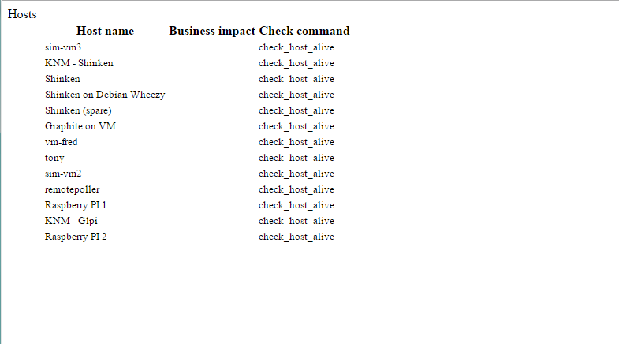
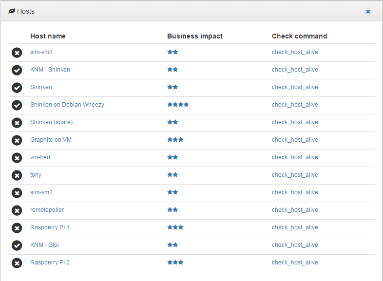

.. _develop:

API
===========

External access
---------------
An external application can embed some Alignak WebUI widgets and pages.

Authentication
~~~~~~~~~~~~~~~~~~~~~~~~

Embedding a part of Alignak WebUI requires an authentication. Provide credentials as a Basic HTTP authentication in the page request. The HTTP request must have an 'Authorization' header  containing the authentication. The Alignak WebUI will use this authentication parameters to check authentication on its Alignak backend.

API
~~~~~~~~~~~~~~~~~~~~~~~~

URL syntax::

    GET <alignak_webui>/external/<type>/<identifier>/<action>

    where:
        <alignak_webui> is the base url of your Alignak WebUI (eg. http://127.0.0.1:8868)
        <type> = `widget` for a widget, <identifier> is the identifier of the widget
        <type> = `table` for a table, <identifier> is the identifier of the table
        <type> = `host` for an host widget, <identifier> is the identifier of the host

        <action> is an optional required action (used internally for the tables)

        <action> is the host widget identifier if <type> = `host`

    URL parameters (GET or POST):
        **page** provides a full HTML page including necessary Css and Js. Suitable for embedding the widget or table in an iframe (see hereunder, Embedding mode)

        **links** provides an URL prefix to be used for the WebUI links. As of it, the links will be prefixed with this value to allow a *redirected* navigation rather than the internal one.

The application response content type is always displayable HTML (eg. `text/html`). Even when an error message is provided. As of it the content can always be included in an HTML page or an iframe HTML element. The HTTP status code is :

    * 401 (Unauthorized) for an unauthorized access
    * 409 (Conflict) for an API error
    * 200 (Success) if content is delivered

The application server implements the CORS an, as of it, filters the external access. The Access Control Allow Origin can be configured in the application configuration file thanks to the **cors_acao** parameter.

Embedding mode
~~~~~~~~~~~~~~~~~~~~~~~~

As default, the widget is provided as it is defined in the Alignak WebUI. The widget is an HTML 
 with its content ...

Use the URL parameter **page** to get a full page embeddable in an iframe. Without this parameter only the required widget is provided as a text/html response.

.. image:: images/api-2.png

Please note that in the default mode (no **page** parameter), it is the caller's responsibility to include the necessary Javascript and CSS files. Currently, those files are (at minimum)::

    <link rel="stylesheet" href="/static/css/bootstrap.min.css" >
    <link rel="stylesheet" href="/static/css/bootstrap-theme.min.css" >
    <link rel="stylesheet" href="/static/css/font-awesome.min.css" >
    <link rel="stylesheet" href="/static/css/alignak_webui-items.css" >

    
    

This list is to be confirmed but it should be the right one ;) All the Css and Javascript files (except for Alignak WebUI...) are easily found on major CDNs.

For some external widgets, it is necessary to include also::

    <!-- Datatables jQuery plugin -->
    <link rel="stylesheet" href="/static/css/datatables.min.css" >
    

Embedding options
~~~~~~~~~~~~~~~~~~~~~~~~

Use the URL parameter **links** to have the navigable links in the embedded page. Else, the links are replaced with their text counterpart.

The **links** parameter must contain the prefix URL used to navigate to the right page for the corresponding link. All links in the widgets are relative from the Web UI home page...
